<div align="center">

# YatriMitra v5.0
### Real-Time Ride Booking Platform · Live GPS · Cloud Integrated


-blue?style=for-the-badge)

> A production-ready ride-booking app prototype connecting passengers with auto, cab, and bike drivers — built with real GPS, live maps, Firebase cloud sync, and a complete booking lifecycle.

</div>

---

##  Download APK

Download the latest build here: [YatriMitra v5.0 APK](https://github.com/SahanaCodes7/Yatri-Mitra/releases/latest/download/YatriMitra.apk)

---

##  Features

###  Authentication
- Email & password registration and login via **Firebase Auth**
- Welcome email sent automatically on registration via **Firebase Email Verification** (zero setup required)
- Optional custom branded welcome email via **EmailJS** integration (200 free emails/month)
- User display name set in Firebase Auth profile on sign-up

###  Booking Flow (MainActivity)
- **Live GPS** pickup using Android FusedLocationProvider — instant via `lastLocation`, with one-shot fallback if GPS is cold-starting
- **Destination search** with real-time autocomplete powered by the **Nominatim / OpenStreetMap API**
- Interactive **OSMDroid map** with pickup marker, destination marker, and live route polyline
- **OSRM routing** for real road-network distance calculation
- Vehicle selection — **Auto (₹20/km)**, **Cab (₹28/km)**, **Bike (₹14/km)** — with dynamic fare preview

###  Driver Matching (DriverSearchActivity)
- Simulated driver pool with real names, vehicle plate numbers, phone numbers, and ratings
- Animated driver search with acceptance countdown
- Driver details (name, plate, phone, rating) passed through the entire booking lifecycle

###  Live Ride Tracking (DriverInfoActivity)
- Driver card showing name, vehicle type, plate number, rating, and OTP
- Trip timeline: Ride Booked → Driver Arrived → Trip Started → Reached Destination
- In-app call screen (InAppCallActivity) with driver name and phone

###  Payment (PaymentActivity)
- Fare breakdown with base fare, tip, and total
- Payment method selection (Cash / UPI)
- Auto-generated transaction ID (`YM########`)
- Trip saved to **Firebase Realtime Database** with full driver details

###  Trip History (TripHistoryActivity)
- Loads trips from Firebase for logged-in users
- Falls back to SharedPreferences for offline/first-load display
- Expandable trip cards showing:
  - Route (pickup → destination)
  - Trip timeline with timestamps
  - **Driver details: name, vehicle plate 🚘, rating ⭐, phone 📞**
  - Fare breakdown and payment info

###  Profile (ProfileActivity)
- Set profile photo from gallery or camera
- Photo copied to **app private storage** (`filesDir/profile_photo.jpg`) — persists across sessions and app restarts
- Displays user name, email, and total trips/spend from SharedPreferences

###  Stats (StatsActivity)
- Total trips, total distance, total spend
- Visual breakdown of ride history

###  Safety Contacts (SafetyContactsActivity)
- Add and manage emergency contacts

### ️ Other Screens
- `SplashActivity` — branded intro screen
- `OnboardingActivity` — first-launch walkthrough
- `HomeActivity` — time-aware greeting, quick booking entry
- `AboutActivity` — app info
- `RouteDetailActivity` / `RouteMapView` — route detail view
- `SettingsActivity` — preferences and driver mode toggle

---

##  Architecture

```
app/src/main/java/com/example/yatrimitra/
├── SplashActivity.kt          → Branded intro + auth check
├── OnboardingActivity.kt      → First-launch walkthrough
├── LoginActivity.kt           → Firebase email/password login
├── RegisterActivity.kt        → Registration + welcome email
├── HomeActivity.kt            → Dashboard with greeting + quick book
├── MainActivity.kt            → Map, GPS, search, vehicle select
├── DriverSearchActivity.kt    → Driver matching simulation
├── DriverInfoActivity.kt      → Live ride screen + driver card + OTP
├── InAppCallActivity.kt       → In-app call UI
├── ArrivalActivity.kt         → Destination reached screen
├── PaymentActivity.kt         → Payment + Firebase trip save
├── TripHistoryActivity.kt     → Trip history from Firebase + local fallback
├── ProfileActivity.kt         → Profile photo + user info
├── StatsActivity.kt           → Ride analytics
├── SafetyContactsActivity.kt  → Emergency contacts
├── SettingsActivity.kt        → App preferences + driver mode
├── AboutActivity.kt           → App info
├── RouteDetailActivity.kt     → Route detail view
├── RouteMapView.kt            → Custom map view component
├── SimulationViewModel.kt     → Vehicle simulation state
├── Vehicle.kt                 → Vehicle data model + ETA logic
├── Stop.kt                    → Stop data model
└── YatriMitraApp.kt           → Application class + SharedPreferences keys
```

---

##  Tech Stack

| Layer | Technology |
|---|---|
| Language | Kotlin |
| Min SDK | 26 (Android 8.0 Oreo) |
| Target SDK | 35 (Android 15) |
| Maps | OSMDroid 6.1.20 (OpenStreetMap) |
| Geocoding | Nominatim API |
| Routing | OSRM (Open Source Routing Machine) |
| Auth | Firebase Authentication |
| Database | Firebase Realtime Database |
| GPS | Google Play Services Location 21.3.0 |
| Networking | OkHttp 4.12.0 |
| Email | Firebase Email Verification + EmailJS (optional) |
| Async | Kotlin Coroutines 1.8.1 |
| UI | Material Components, ConstraintLayout, FlexboxLayout |
| Architecture | MVVM (ViewModel + StateFlow) |

---

##  Getting Started

### Prerequisites
- Android Studio Hedgehog or later
- JDK 11+
- A Firebase project

### Setup

1. **Clone the repository**
   ```bash
   git clone https://github.com/SahanaCodes7/Yatri-Mitra.git
   cd Yatri-Mitra/yatrimitra_v5
   ```

2. **Add Firebase config**
   - Go to [Firebase Console](https://console.firebase.google.com) → your project → Project Settings
   - Download `google-services.json`
   - Place it in `app/google-services.json`

3. **Enable Firebase services**
   - Firebase Console → **Authentication** → Sign-in method → enable **Email/Password**
   - Firebase Console → **Realtime Database** → Create database → start in test mode

4. **Customize the welcome email** *(optional but recommended)*
   - Firebase Console → Authentication → **Templates** → Email address verification
   - Update the subject to: `Welcome to YatriMitra! 🛺`
   - Update the body to greet the user by name

5. **Enable custom branded emails via EmailJS** *(optional — 200 free/month)*
   - Sign up at [emailjs.com](https://www.emailjs.com)
   - Create a service (Gmail or any SMTP provider)
   - Create a template using these variables: `{{to_name}}`, `{{to_email}}`, `{{join_date}}`, `{{app_name}}`
   - In `RegisterActivity.kt`, replace the three placeholder values:
     ```kotlin
     put("service_id",  "your_service_id")
     put("template_id", "your_template_id")
     put("user_id",     "your_public_key")
     ```

6. **Build and run**
   ```bash
   ./gradlew assembleDebug
   ```
   Or open in Android Studio and click **Run**.

---

##  Key SharedPreferences Keys (`YatriMitraApp.PREFS`)

| Key | Description |
|---|---|
| `profile_photo_uri` | Path to saved profile photo in app private storage |
| `pref_last_txn_id` | Last transaction ID |
| `pref_last_txn_amount` | Last fare paid |
| `pref_last_txn_method` | Last payment method |
| `pref_last_driver_name` | Last driver's name |
| `pref_last_driver_plate` | Last driver's vehicle plate |
| `pref_last_driver_phone` | Last driver's phone number |
| `pref_last_driver_rating` | Last driver's rating |
| `total_trips` | Cumulative trip count |
| `total_spent` | Cumulative spend (float) |

---

##  Firebase Realtime Database Schema

```json
{
  "ride_requests": {
    "<ride_id>": {
      "pickup_lat": 12.9716,
      "pickup_lon": 77.5946,
      "dest_lat": 12.9352,
      "dest_lon": 77.6245,
      "vehicle": "Auto",
      "fare": 81,
      "status": "searching"
    }
  },
  "trip_history": {
    "<uid>": {
      "<trip_id>": {
        "userId": "...",
        "route": "Destination Name",
        "pickup": "Pickup Name",
        "driverName": "Rajan Kumar",
        "driverPlate": "KA 01 AB 1234",
        "driverRating": "4.8",
        "driverPhone": "+91 98450 11234",
        "vehicle": "Auto",
        "distKm": 4.05,
        "fare": 81,
        "tip": 0,
        "totalPaid": 81,
        "paymentMethod": "Cash",
        "txnId": "YM55785787",
        "timestamp": 1747123800000
      }
    }
  },
  "welcome_emails": {
    "<uid>": {
      "to": "user@email.com",
      "name": "User Name",
      "joinDate": "14 May 2026",
      "sentAt": 1747123800000
    }
  }
}
```

---

##  Screenshots

### Onboarding & Home
| Onboarding | Home |
|:---:|:---:|
| 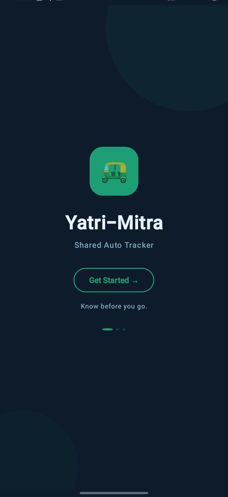 | 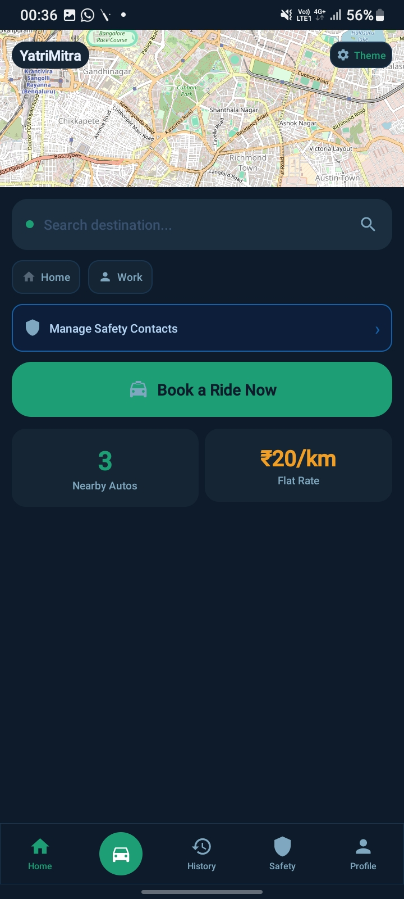 |

### Booking & Driver Arrival
| Booking | Driver Arrival |
|:---:|:---:|
| 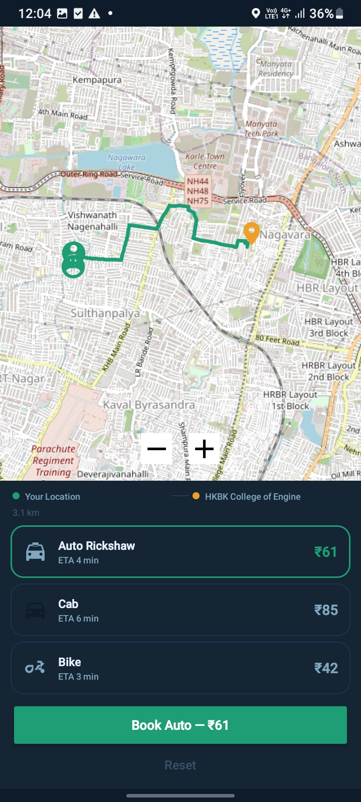 | 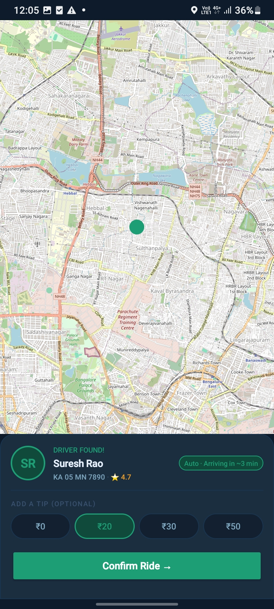 |

### Ride Progress
| Arrived | Payment |
|:---:|:---:|
| 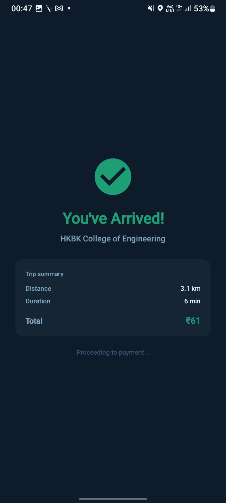 | 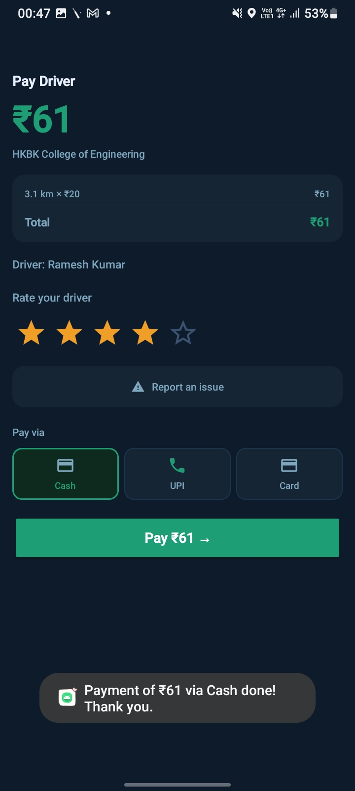 |

### History & Profile
| Trip History | Profile |
|:---:|:---:|
| 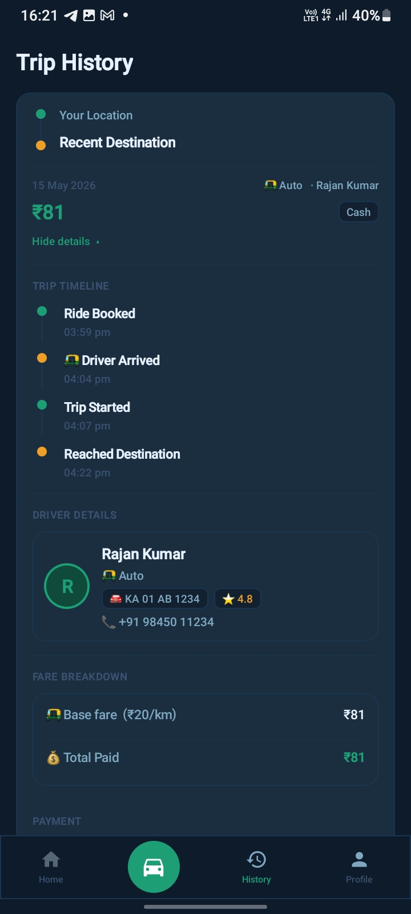 | 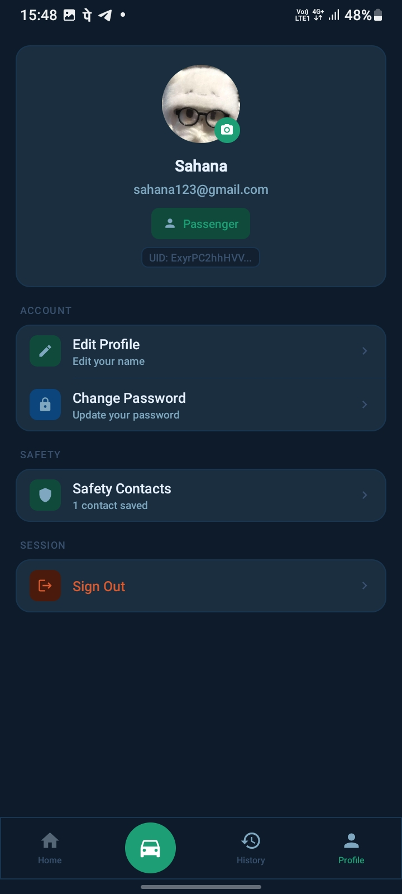 |

### Settings, Safety & Driver
| Settings | Safety Contacts | Driver |
|:---:|:---:|:---:|
| 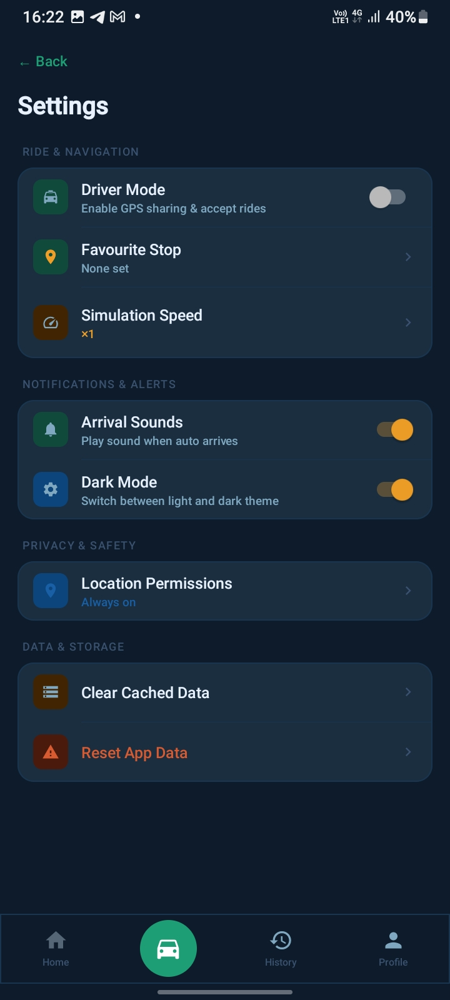 | 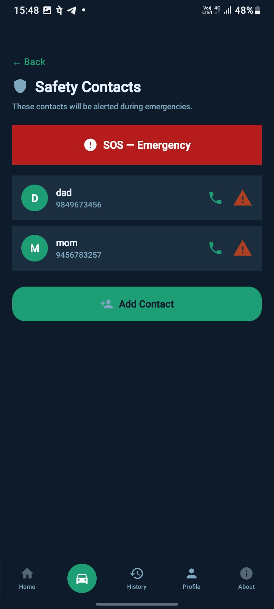 | 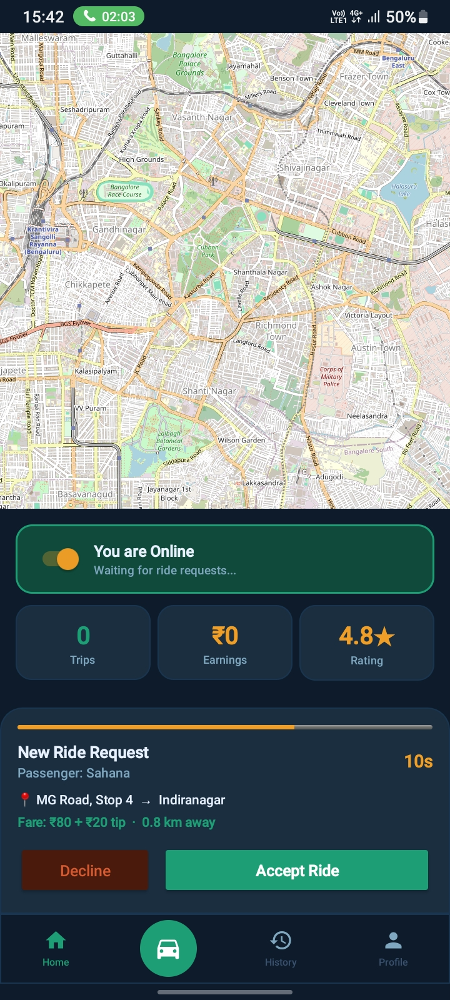 |

### About
| About |
|:---:|
| 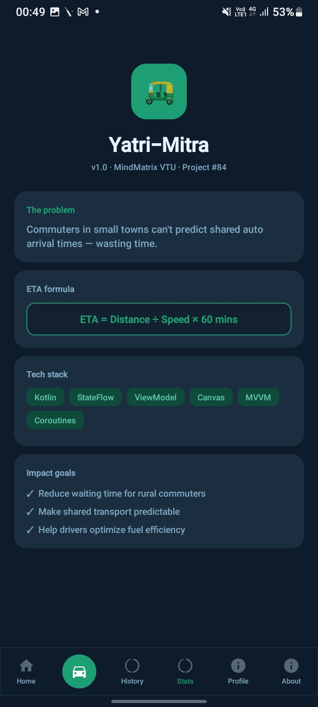 |

---

>  **How to add your screenshots:**
> 1. Take screenshots on your phone or emulator
> 2. Create a `screenshots/` folder inside `YatriMitra\yatrimitra_v5\`
> 3. Save each file with exactly the name shown, then `git add screenshots/` and push
>
> | File name | Screen to capture | How to reach it |
> |---|---|---|
> | `screen1_onboarding.jpeg` | Onboarding / welcome slides | Fresh install before login |
> | `screen2_home.jpeg` | Home dashboard with greeting | After login |
> | `screen3_booking.jpeg` | Map with pickup + destination set, vehicle panel open | Book a ride |
> | `screen4_driver_arrival.jpeg` | Driver search / driver accepted screen | After confirming booking |
> | `screen5_arrived.jpeg` | Reached destination screen | End of trip |
> | `screen6_payment.jpeg` | Payment screen with fare breakdown | After arrival |
> | `screen7_history.jpeg` | Trip history expanded with driver details | History tab → View trip details |
> | `screen8_profile.jpeg` | Profile screen with photo and stats | Bottom nav → Profile |
> | `screen9_settings.jpeg` | Settings / preferences screen | Bottom nav → Settings |
> | `screen10_safety.jpeg` | Safety contacts screen | Settings → Safety Contacts |
> | `screen11_driver.jpeg` | Driver info screen with OTP and timeline | During active ride |
> | `screen12_about.jpeg` | About screen | Settings → About |

---

##  Changelog

### v5.0 (Current)
-  Driver details (name, plate, **phone number**) now saved and displayed in Trip History
-  Profile photo persists across sessions (copied to app private storage)
-  Welcome email sent on registration via Firebase Email Verification
-  GPS "Use current location" fixed — instant via `lastLocation` + one-shot fallback
-  `onRequestPermissionsResult` now properly starts location tracking after grant
-  EmailJS integration for custom branded welcome emails

### v4.0
- Trip history loaded from Firebase with local SharedPreferences fallback
- Payment screen with fare breakdown and transaction ID

### v3.0
- Real-time OSMDroid map with OSRM routing
- Nominatim search autocomplete
- Firebase Realtime Database integration

### v2.0
- Firebase Auth (login + registration)
- Driver simulation with animated search
- Vehicle type selection with dynamic pricing

### v1.0
- Initial simulation prototype

---

<div align="center">

**Project #84 · VTU MindMatrix**
Built for real-world mobility efficiency · Bengaluru, India 🇮🇳

</div>
